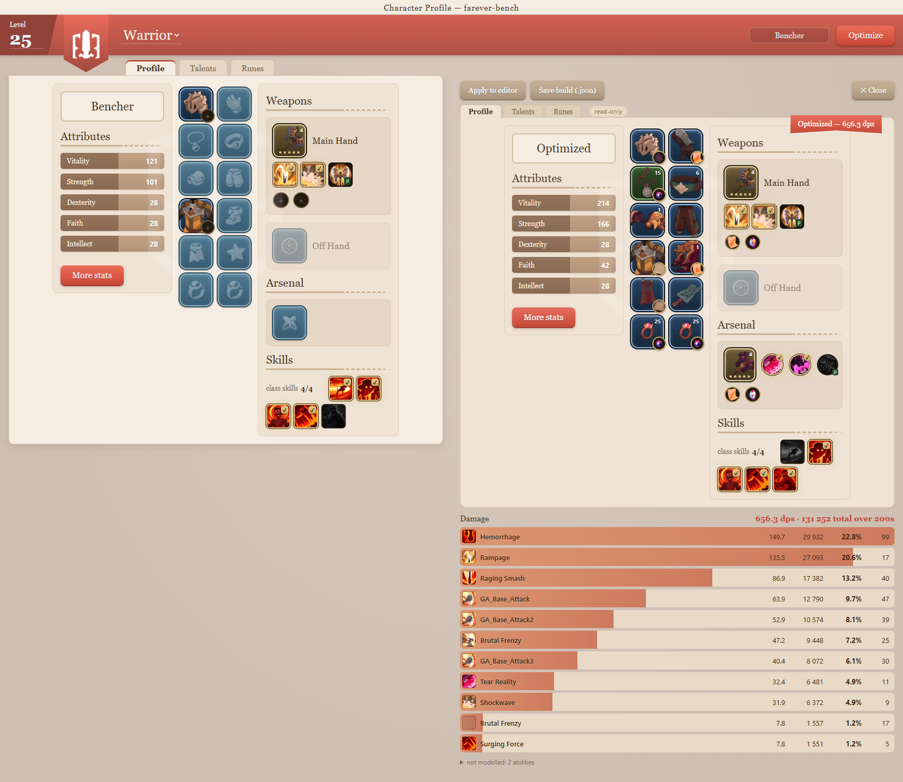
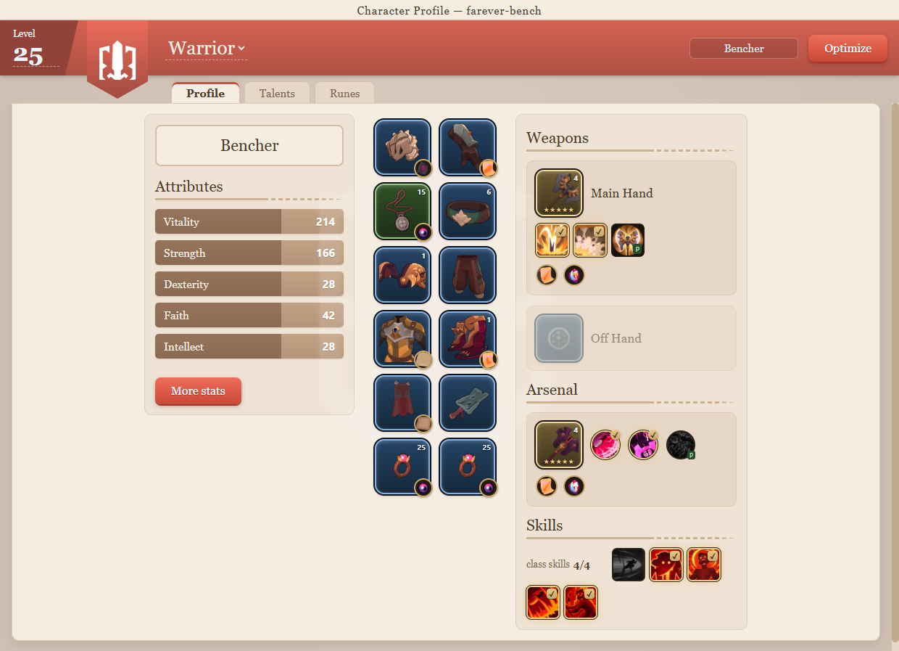
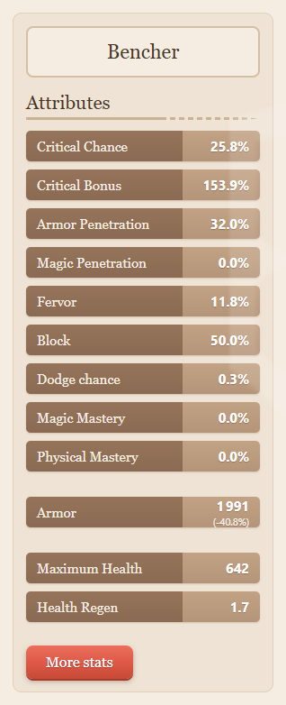
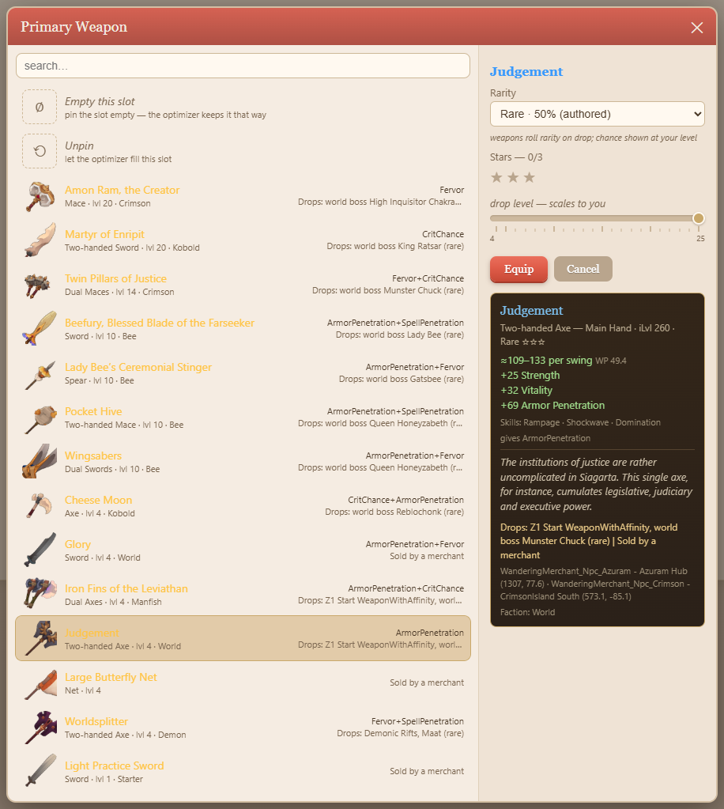
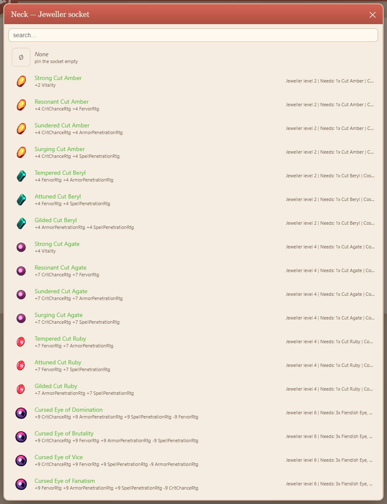
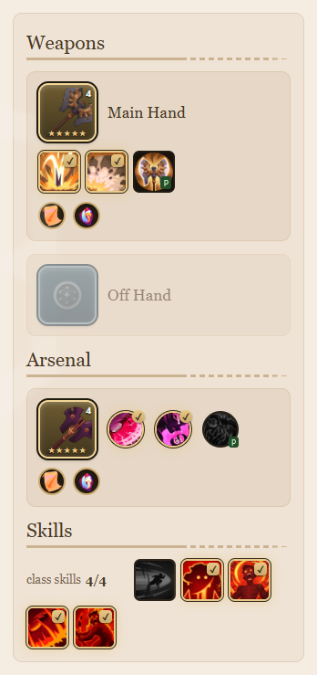
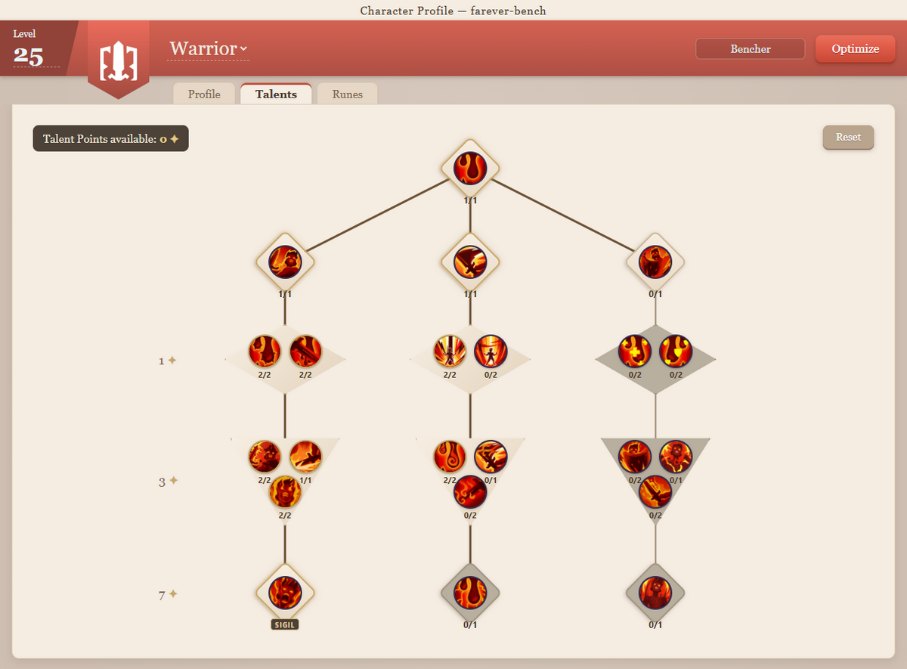
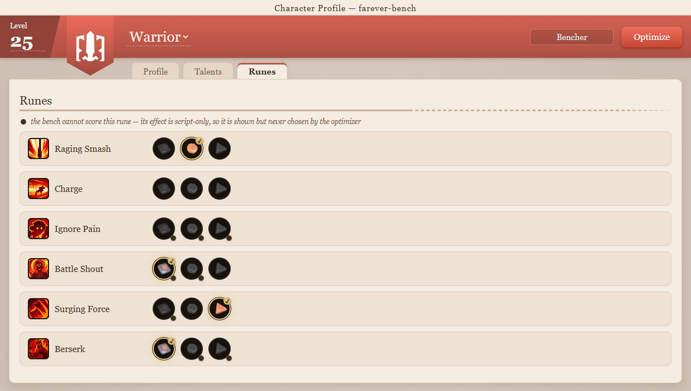
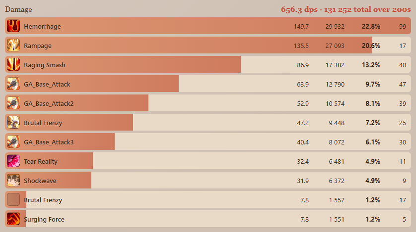

# farever-bench

A gear bench and damage simulator for **Farever** (Shiro Games). Every number
it prints comes out of `data.cdb` in your own installed copy of the game — and
in the UI, every icon comes out of your own `res.pak` — so the answers are your
game's answers, at the patch you are actually playing. Pin whatever you have
already decided — a weapon, a chest piece, an empty trinket slot — and it fills
the rest: every armour slot, both weapons, the offhand, all the enchant and gem
sockets, the talent tree, the runes, and the skills each weapon lets you slot.

**You need Farever installed**, whichever way you run it. Nothing game-derived
is redistributed here, so there is no standalone mode and no bundled database.



---

## Quick setup

| | what it needs | how you start it |
|---|---|---|
| **`FareverBench.exe`** — the desktop app | Windows 10+ x64. Nothing else to install: Node, the engine and the UI are inside it. It is **unsigned**, so SmartScreen says *"Windows protected your PC"* — click **More info** → **Run anyway**. | Double-click it. |
| **`bench ui`** — the same UI, in your own browser | [Node.js](https://nodejs.org/) 18+. Windows, Linux or macOS. No Chromium download and no signature dialog. | `bench ui --open` |
| **`bench <command>`** — the command line | [Node.js](https://nodejs.org/) 18+. Windows, Linux or macOS. | `bench optimize --class Warrior` |

The last two are the same download and the same source tree, so choosing
between them is a matter of taste, not of installing anything twice.

### The shortest path to a first result

**The desktop app.** Take `FareverBench-v0.1.0.exe` from
[Releases](https://github.com/Blaakan/farever-bench/releases), run it, click
past SmartScreen, pick a class, press **Optimize**. On first run it finds the
game through Steam's library list; if it cannot, it asks for the folder — the
one holding `Farever.exe` and `hlboot.dat` — and remembers the answer.

**The UI in your browser.** Take `farever-bench-v0.1.0.zip` from the same
place, unzip it, and from the folder it makes:

```bash
bench-ui            # Windows          (bench-ui.cmd)
./bench-ui.sh       # Linux, macOS
```

Either one is `bench ui --open` and nothing else: it starts a server bound to
`127.0.0.1`, opens your browser at it, and prints the URL. `--port <n>` pins
the port; `Ctrl+C` stops it.

**The command line.** Same zip, same folder:

```bash
bench optimize --class Warrior                  # Windows      (bench.cmd)
node bin/bench.mjs optimize --class Warrior      # Linux, macOS
```

Everything below writes `bench`; on Linux and macOS that is
`node bin/bench.mjs`. Cloning the repo works too — there is nothing to build
and nothing to install, because the tool has no runtime dependencies:

```bash
git clone https://github.com/Blaakan/farever-bench
cd farever-bench
node test/run.mjs                    # 948 checks against your own game data
node bin/bench.mjs optimize --class Warrior
```

### Finding the game

Auto-detection reads Steam's own registry keys, which only exist on Windows.
Anywhere else — and on Windows when the library list is unusual — name the
folder:

```bash
bench optimize --class Warrior --game "E:\SteamLibrary\steamapps\common\Farever"
bench ui --open --game ~/.steam/steam/steamapps/common/Farever   # a Proton install
```

The path is remembered in `.cache/`, so you answer once. The packaged exe
unpacks to a fresh temp folder every launch and so keeps its answer in
`%APPDATA%\farever-bench-ui\settings.json` instead; run it with `--setup` to
change it.

Everything is read-only. The tool never touches the game process, writes
nothing to the install directory, and makes no network connection — with one
opt-in exception: handing it a [questlog.gg build
link](#importing-a-build-from-questloggg) fetches that build and pins it.

---

## What it simulates, stated plainly

A dps figure is only worth as much as the fight it was measured over, so the
fight is stated with every number rather than assumed. The defaults:

| | default | what it means |
|---|---|---|
| fight length | `--fight 200` | a 200-second fight, which is what a damage meter reports |
| target | `--target boss` | a **named boss** (Ratsar) — not a dummy, and not the game's own `Armor_ExpectedReduction` constant, which sits well under what you actually fight |
| target health | `--target-health 100` | it stands at **full** health, so every execute rider in the game is off |
| enemies hit | `--targets 1` | honest single-target: nothing scales with a crowd |
| weapon mastery | `--rank max` | rank 3 — a weapon you have finished. Every skill it grants, passives included, takes two upgrades |
| upgrade stars | `--stars max` | weapons at the most stars their rarity allows; armour has no upgrade path at all |

Four of those are the levers that move an answer most, and each is an **input**
rather than a derived number for a reason the data itself gives:

- **`--targets <n>`** — most of a build's damage is area-borne. The geometry is
  fully authored, shape and range and an expanding radius, but *nothing
  anywhere says how many enemies stand inside it*: placement is level data.
  This is the first flag to reach for when the tool's number looks low against
  an in-game meter.
- **`--target-health <pct>`** — eight script clauses across seven weapons
  compare the target's health against a threshold. Which phase of a fight you
  are asking about is not something a table can answer, so you say it, and the
  comparison is then answered exactly.
- **`--target <t>`** — `dummy | small | trash | big | elite | boss | dungeon |
  reference`, or any unit id. What penetration buys depends entirely on this:
  nothing at all against a 0-armour dummy, +16.9% against the default boss,
  +35.4% against an elite. `bench targets` prints the whole ladder.
- **`--fight <s>`** — a 20-second pull and a 200-second one weight cooldowns
  completely differently. The default matches what a meter shows you.

Two more worth knowing: `--fights <n>` rolls the procs, the ±10% swing band
and the crit for real instead of folding them in at their expected rate, and
reports the mean and the spread; `--goal <g>` swaps the objective between
`dps`, `hps`, `sps`, `ehp` and `mixed`.

The damage column **adds up**: every ability's total sums to the overall, the
base-attack chain is broken out per link rather than hidden behind one row, and
HITS counts damage *events* — a dot's tick, each hit of a multi-hit cast, one
per target of a cleave — which is what a damage meter counts, so the two
reconcile row by row.

---

## The UI

The same page whether it arrived as an exe or through `bench ui`. Three tabs —
**Profile**, **Talents**, **Runes** — over a character sheet built to the
game's own layout, with the game's own icons and tooltips.

### The character sheet



Twelve armour slots down the middle in the game's visual order, attributes on
the left, weapons on the right. Click a slot to pick an item; right-click it to
unpin it again. A number in a slot's corner is the item's own level, the stars
under the icon are its upgrade level, and the small disc at the bottom right is
its socket — click that instead and you are choosing the enchant or the gem
rather than the item.

Every slot you touch becomes a **pin**: **Optimize** holds it and searches
around it. A slot you never touch is left free. Those are three different
states and the picker names all three — an item, *Empty this slot* (pinned
empty, and the optimizer keeps it that way), and *Unpin* (let the optimizer
fill it).

The left column starts on the five primaries. **More stats** turns it over to
everything else — the same second page the game shows you, with the conversions
the game does not:



Armour carries its own reduction next to it (`1991`, `-40.8%`), because the
number alone means nothing without the target it was computed against.

### Picking an item



The list is every item legal in that slot for that class, at that level. The
right-hand pane is what you are about to equip, and the four controls above it
are the four things about an item that are not fixed by its row:

- **Rarity** — a weapon rolls its rarity when it drops, so the dropdown gives
  every rarity it can roll and the chance of each *at your level*. Gear does
  not roll: its rarity is authored, and the dropdown says so.
- **Stars** — upgrade level. **Only weapons can be upgraded**; the game's own
  window text says so and the twenty `<WeaponType>_Upgrade` skills exist for
  weapon types only. Armour has no star row at all.
- **Drop level** — a weapon is *generated* at the level of whatever dropped it,
  so the slider is which instance you are holding. Gear is authored and keeps
  its own level, so the slider does not appear for it.
- **The tooltip** — the exact affix bake, the weapon's damage range and
  WeaponPower, the skills it grants, its faction, and **where it drops**, down
  to the merchant's coordinates.

Sockets are their own picker, listing every augment the socket can host with
what each one pays and what crafting it costs:



### Weapons and the arsenal



Under each weapon are the skills it offers. A lit tile with a tick is slotted;
a dimmed one is not. **A weapon offers three skills and you get two**, so this
is a real build decision — click a tile to change it.

The **arsenal** is the second weapon. It contributes `ceil(stat × 0.4)` of its
stats and its two slotted skills, and nothing else: you do not swap to it, so
it brings no base-attack chain and no combo. That is checked against the game —
the same spear reads +36/+18/+15/+39/+39 in the main hand and +15/+8/+6/+16/+16
in the arsenal.

The tile marked **P** is a passive, and it is one of the pool's picks like any
other: **taking the arsenal's passive spends one of its two skill slots.** That
is the surprising part of the arsenal, so the badge is there to say it out
loud. A passive with no badge was granted rather than chosen, and costs
nothing.

### The talent tree



The real tree with the real rules. Left-click a node to spend a point,
right-click to take one back — and taking a point out of a node that another
one stands on empties what it fed, because the tier thresholds are counted the
way the game counts them: points spent **at lower tiers in that branch**, root
included, `t1=1 t2=2 t3=4 t4=8`.

The counter at the top left is what you have left to spend. A node badged
**SIGIL** was granted outright by a Demon sigil in your head slot: it costs no
point and does not count toward its branch's thresholds.

Touch any node and the whole allocation becomes a pin — a half-pinned tree is
not something the search can legally complete.

### The rune page



Every skill the build knows, with its three runes. Click one to slot it; click
it again to empty the slot.

A rune marked with a dot is one **the bench cannot score** — its effect lives
in a script rather than in a column, so it is shown and described but never
chosen by the optimizer. 31 of the 84 runes declare something readable (they
gate a step, suppress one, override a cooldown or charge count, or gate a stat
affix); the other 53 promise things that live in code. Slotting one by hand
still pins it, which is how you ask *what does the rest of the build look like
if I take this*.

### Optimize

Press **Optimize** and the search fills every slot and socket you did not pin,
picks the skills, allocates the tree, slots the runes, and plays a 200-second
fight. It runs in its own process and streams progress while it goes; a full
class from nothing takes about a minute.

The answer arrives on a **second sheet beside yours**, marked `read-only`:


Nothing on the right can be edited — it is the search's answer, not a build in
progress — but every tooltip works, and its own **Profile / Talents / Runes**
tabs show what it chose in the tree and the rune page. **Apply to editor**
moves the whole thing to your side, where it becomes yours to change; **Save
build (.json)** writes the same envelope `--json` writes, which
`bench optimize --build <file>` reads back and reproduces exactly.

Under it, the damage meter, in the game's names and icons:



Per row: dps, total damage, share of the whole, and **hits** — damage events,
the same thing an in-game meter counts. `not modelled: 2 abilities` at the
bottom expands into what the model could not score and why, which is the part
of the answer worth reading before you trust the rest of it.

---

## The command line

| | |
|---|---|
| [`optimize`](#bench-optimize) | fill every unpinned slot and socket with the best combination |
| [`sheet`](#bench-sheet) | the stat sheet a build produces, with rating→percent conversions |
| [`rank`](#bench-rank) | rank every item that fits one slot against your current build |
| [`items`](#bench-items) | every item legal in a slot for a class |
| [`weapons`](#bench-weapons) | every mainhand, ranked at one stat corner |
| [`layouts`](#bench-layouts) | the best full build for every ordered (mainhand, arsenal) pair |
| [`rotation`](#bench-rotation) | search for the rotation a weapon wants, and the kit that goes with it |
| [`talents`](#bench-talents) | the talent trees and runes, and how much of them is readable |
| [`targets`](#bench-targets) | what the world actually resists, and what penetration buys |
| [`profiles`](#bench-profiles) | the stat corners a weapon or a rotation can be compared at |
| [`classes`](#bench-classes) | the playable classes and what they scale off |
| [`slots`](#bench-slots) | the slots, their share of the stat budget, and which augments they host |
| [`rarity`](#bench-rarity) | which rarities each slot can reach, and how that is derived |
| [`audit`](#bench-audit) | every assumption and gap in the model |
| [`ui`](#quick-setup) | the same sheet in your own browser |
| [`update`, `verify`](#two-more-commands) | the patch-day pipeline, and the model against a recorded capture |

Every command takes `--class`, `--level`, `--target`, `--fight`, `--goal`,
`--game` and the pins; `bench --help` prints the lot. Every command prints its
provenance first — the tool's version, the fingerprint of the `data.cdb` and
`hlboot.dat` it read, and where it read them:

```
farever-bench 0.1.0
cdb b7a48efb  boot 90b98741  game E:\SteamLibrary\steamapps\common\Farever
```

That header is elided from the examples below. Long outputs are trimmed, and
the trim is marked `...`.

### Pinning

Pinning is the point. Anything you pin is held fixed and everything else is
optimised around it.

```bash
--pin chest=Chest_RManfish_Cle       # fix an item
--pin weapon1=Sword_Swarm*3          # fix an item at 3 upgrade stars
--pin trinket=none                   # force a slot empty
--pin feet/enchantfeet=none          # force one socket empty
--pin chest=Chest_RManfish_Cle@Epic  # assume a particular drop rarity
--pin weapon1=Spear_Eruption^10*0    # the instance that dropped at level 10, unupgraded
--no-augment weapon1                 # no augments at all on that slot
```

The grammar on an item is `id` `^instanceLevel` `@rarity` `*stars`, every
suffix optional but in that order, and `none` in place of an item pins the slot
empty. Slot and item names are matched loosely — `chest`, `Chest`, `Slot_Chest`
and `fingerleft` all work — and an ambiguous name is an error that lists the
candidates rather than a silent guess. With no `@rarity` given you get the best
the slot can reach, the same "assume the good version" default `--stars max`
already applies.

Three more pins are not gear:

```bash
--skills weapon1=GA_Craft_Skill1,GA_Craft_Skill2                # slot 2 of the 3 a weapon offers
--skills prayers=Smite,Life                                     # choose the prayer sequence
--rune Warrior_Berserk=Warrior_Berserk_M3                       # one rune slot; repeatable, =none empties it
--talent Warrior_Hemorrhage=1 --talent Warrior_Talent_Sever=1   # naming ANY node fixes the WHOLE tree
```

`--rune` is per slot: every other rune is still searched. `--talent` is not,
and cannot be — the tree has tier thresholds, and a half-pinned allocation is
not something the search can complete legally. Which is why the pair above is
two flags and not one: Sever is tier 1 in the Center branch and wants a point
below it, so pinning it alone is refused with the reason, not silently fixed
up. A wrong id in any of the three is an error that prints the ones that exist.

### `bench optimize`

Fill every unpinned slot and socket with the best combination.

```bash
bench optimize --class Warrior
```

```
Warrior 25 - maximising dps vs named boss (Ratsar: S 1.10/1.10) @L6.9 (rift-R1 fit)
upgrade stars: max for rarity   weapon mastery: rank 3, fully mastered   rarities: all   drop-rarity: rolled   excluding /^GM_/

SLOT           ITEM                     RAR        UPG    iLVL  FACTION  GIVES
Weapon1        Judgement                Legendary  *****   350  World    ArmorPenetration         rolled
Weapon2        Worldsplitter            Legendary  *****   350  Demon    Fervor+SpellPenetration  rolled
OffhandWeapon  (empty)
Head           Crown of the Sea         Rare               260  Manfish  ArmorPenetration
Neck           Necklace of Precision    Uncommon           150  Crit     CritChance
Shoulders      Gaping Mouths Pauldrons  Rare               260  Demon    Fervor
Chest          Whirring Gem of Apix     Rare               260  Bee      ArmorPenetration
Back           Crimson Wings            Rare               260  Crimson  Fervor
Hands          Unholy Crimson Gloves    Rare               260  Crimson  Fervor
Waist          Caryapsid's Coccyx       Rare               260  Craft    ArmorPenetration
Legs           Wrong Trousers           Rare               260  Kobold   CritChance
Feet           Demonic Crushers         Rare               260  Demon    Fervor
FingerLeft     Set Eye of Zeal          Rare               260  Fervor   Fervor
Trinket        Raclette Pan             Rare               260  Kobold   ArmorPenetration
FingerRight    Set Eye of Zeal          Rare               260  Fervor   Fervor

AUGMENTS
SLOT         SOCKET         AUGMENT                         EFFECT
Weapon1      EnchantWeapon  Magic Formula: Zealot
Weapon1      Demon          Corrupted Gift                  -40 SpellPenetrationRtg +40 CritChanceRtg
Weapon2      EnchantWeapon  Magic Formula: Devote
Weapon2      Demon          Corrupted Gift                  -40 SpellPenetrationRtg +40 FervorRtg
Head         DemonSigil     Sigil of Bet'Hatesht            grants Surge of Violence - a next-cast register
Neck         Jeweller       Cursed Eye of Brutality         +9 CritChanceRtg +9 FervorRtg +9 ArmorPenetrationRtg -9 SpellPenetrationRtg
...

TALENTS
  16 of 16 points spent, 1 granted by a sigil
  TIER  BRANCH  TALENT             RANK          GIVES
  4     Left    Surge of Violence  from sigil    a next-cast register
  0     Root    Hemorrhage                       35% of physical crits as a bleed
  1     Center  Sever                            +20% crit damage on weapon skills
  1     Left    Seasoned Soldier                 +1 Rage per crit
  2     Left    Bloodletting       2/2           +20% damage on bleeds
  ...

SKILLS
POOL              SLOTS  TAKEN
main-hand skills  2/2    Rampage, Shockwave                                 always on: Domination
arsenal skills    2/3    Tear Reality, Dark Gift                            not taken: Resilience of the Unkillable Demon King
class skills      4/5    Ignore Pain, Battle Shout, Surging Force, Berserk  not taken: Charge

not scored in this build (2) - --verbose for what and why

RUNES
  SKILL          SLOTTED              READABLE  WHAT IT CHANGES
  Raging Smash   Scent of Battle      3/3       changes its cost
  Charge         (none)               3/3
  Ignore Pain    (none)               0/3
  Battle Shout   Battle Fury          1/3       nothing this model can read
  Surging Force  Concentrated Impact  2/3       +40% damage at one target
  Berserk        Releasing the Beast  1/3       overrides cooldown
  ...

Primary
  attribute  value
  Strength     166
  Dexterity     28
  Intellect     28
  Faith         42
  Vitality     214

Offence
  attribute                value
  WeaponPower              49.43
  CritChanceRating           148  -> CritChance 7.79pp   +1 = +0.0526pp
  CritChance               25.77
  CritDamage              153.88
  ArmorPenetrationRating     243  -> ArmorPenetration 31.98pp   +1 = +0.1316pp
  ArmorPenetration         31.98
  ...

DAMAGE
                               DPS   DAMAGE  SHARE  HITS
  overall                    656.3  131,252          339
  Hemorrhage                 149.7   29,932  22.8%    99
  Rampage                    135.5   27,093  20.6%    17
  Raging Smash                86.9   17,382  13.2%    40
  GA_Base_Attack              63.9   12,790   9.7%    47
  GA_Base_Attack2             52.9   10,574   8.1%    39
  Brutal Frenzy (filler)      47.2    9,448   7.2%    25
  GA_Base_Attack3             40.4    8,072   6.1%    30
  Tear Reality                32.4    6,481   4.9%    11
  Shockwave                   31.9    6,372   4.9%     9
  Brutal Frenzy (triggered)    7.8    1,557   1.2%    17
  Surging Force                7.8    1,551   1.2%     5
```

`--verbose` adds back everything that *explains* a number rather than being
one: the search trace, the rotation and its reasoning, the cause of every
refusal, the talent coverage note, and the assumptions-and-gaps list. `--json
<file>` writes the whole envelope, and `--build <file>` reads it back and
reproduces the run — its recorded goal, target, level, fight and pins become
the defaults, so a saved build is a starting point as well as a record.

### `bench sheet`

The stat sheet a build produces, with the rating→percent conversions.

```bash
bench sheet --class Warrior --pin weapon1=GA_Craft
```

```
SLOT           ITEM       RAR        UPG    iLVL  FACTION  GIVES
Weapon1        Judgement  Legendary  *****   350  World    ArmorPenetration  rolled
Weapon2        (empty)
...

SKILLS
POOL              SLOTS  TAKEN
main-hand skills  2/2    Rampage, Shockwave                                always on: Domination
class skills      4/5    Charge, Ignore Pain, Battle Shout, Surging Force  not taken: Berserk

not scored in this build (2), by cause:
  conditional  it procs, but only while something this reader cannot evaluate holds
    Rampage (GA_Craft_Skill1)
  gated off  its script gates it on a rank or a talent this build does not have
    Ignore Pain (Warrior_IgnorePain#SelfHeal)

Primary
  attribute  value
  Strength      81
  Dexterity     28
  Intellect     28
  Faith         28
  Vitality      99
...

METRIC                        VALUE
damage / s                    142.2  <- goal
healing / s                     0.0
shielding / s                   0.0
effective HP                  1,076
  physical / magical  1,076 / 1,076  reduction 0.0% / 0.0%
time on cooldowns             42.3%  57.6% swinging, 0.1% idle
fight                          200s  one 200s fight, procs at their expected rate

ROTATION   attacks 0.63/s, combos 0.14/s
  played both ways over a 8s lookahead and kept the better: priority order 142.2, sequenced 142.0 - nothing here rewards ordering, so priority order stands
  SKILL            KIND       PER CAST    EVERY  SHARE
  Rampage          active        520.3   12.50s    24%
  GA_Base_Attack   filler         80.6    4.26s    18%
  Brutal Frenzy    filler        123.8    6.90s    12%
  GA_Base_Attack2  filler         80.2    4.76s    15%
  GA_Base_Attack3  filler         80.6    5.41s    13%
  Raging Smash     active        114.4    8.33s     5%
  Shockwave        active        232.7   25.00s     4%
  Charge           active         85.7   15.38s     7%
  Brutal Frenzy    triggered      21.1   10.58s         Brutal Frenzy's Attack step is played on a base attack, 15% of the time
  ...
```

Nothing is searched here: `sheet` evaluates exactly the build you describe,
which makes it the command to reach for when you want to know what one specific
set of gear does — and, run twice with one pin changed, what that change is
worth. `METRIC` is every goal at once, so a dps run still tells you what it cost
you in effective health.

### `bench rank`

Rank every item that fits one slot, against your current build.

```bash
bench rank --class Warrior --slot chest --pin weapon1=GA_Craft
```

```
Warrior 25 - ranking Chest by dps vs named boss (Ratsar: S 1.10/1.10) @L6.9 (rift-R1 fit)

  ITEM                      RAR       ROLL  UPG  FACTION  GIVES                                DPS   DELTA
  Chest_RBee_Fig            Rare                 Bee      ArmorPenetration                   155.0  +8.97%
  Chest_RCrimson_Fig_Craft  Rare                 Craft    ArmorPenetration                   155.0  +8.97%
  Chest_RCrimson_FigCle     Rare                 Crimson  Fervor                             149.9  +5.39%
  Chest_RKobold_FigAss      Rare                 Craft    ArmorPenetration+CritChance        149.3  +4.95%
  Chest_RDemon_FigCle       Rare                 Demon    Fervor+SpellPenetration            148.9  +4.66%
  Chest_RManfish_FigWiz     Rare                 Manfish  ArmorPenetration+SpellPenetration  148.7  +4.53%
  Chest_Z1U1_FigAss         Uncommon             -        -                                  147.7  +3.82%
  ...

... 9 more (--all to see them)
```

Every row is the whole objective re-evaluated with that item equipped, not a
stat weight — see [why not stat weights](docs/MODEL.md#why-not-stat-weights).

### `bench items`

Every item legal in a slot for a class.

```bash
bench items --class Warrior --slot chest
```

```
Warrior 25 - Chest - 24 legal (item, rarity) pairs

ITEM                      NAME                                  RAR       ROLL  MAX UPG       LVL  FACTION  GIVES                              SKILLS
Chest_C_BaseClothes       White Shirt                           Common                0  (scales)  -        -
Chest_Starter_Fig         Squire's Brigandine                   Common                0         1  -        -
Chest_Z1U1_Fig            Reinforced Hauberk of the Exile       Uncommon              0         2  -        -
Chest_Z1U2_Fig            Reinforced Hauberk of the Trespasser  Uncommon              0         8  -        -
Chest_RBee_Fig            Whirring Gem of Apix                  Rare                  0  (scales)  Bee      ArmorPenetration
Chest_RCrimson_Fig_Craft  Scarlet Breastplate                   Rare                  0        20  Craft    ArmorPenetration
Chest_Z2U1_Fig            Reinforced Hauberk of the Adventurer  Uncommon              0        13  -        -
Chest_Z2U2_Fig            Reinforced Hauberk of the Nomad       Uncommon              0        18  -        -
Chest_RKobold_FigAss      Cantal Goya's Breastplate             Rare                  0         6  Craft    ArmorPenetration+CritChance
...
Chest_RManfish_FigWiz     Fin Armor                             Rare                  0  (scales)  Manfish  ArmorPenetration+SpellPenetration
...
Chest_RDemon_FigCle       Soul Visage                           Rare                  0         1  Demon    Fervor+SpellPenetration
```

`GIVES` is the item's secondary stat, and it is decided by the **faction**, not
by the item: the same Manfish chest gives a Priest Fervor and a Warrior
ArmorPenetration out of one data row. Gear with no faction has no secondary
stat at all.

### `bench weapons`

Every mainhand, ranked at one stat corner.

```bash
bench weapons --class Warrior --profile armorpen
```

```
Warrior 25 - every mainhand, ranked by dps vs named boss (Ratsar: S 1.10/1.10) @L6.9 (rift-R1 fit)
profile: ArmorPenetrationRating at 100  - every stat pinned to 50, ArmorPenetrationRating to 100
  pinned: Strength 50   Dexterity 50   Intellect 50   Faith 50   ...
  ! these stats are pinned to flat values, not earned from gear - the number is a comparison between builds on the same rig, never a dps anyone will read in game
13 weapons in 18.9s   weapon mastery: rank 3   skills, talents and runes chosen per weapon   arsenal: searched   no armour, no offhand, no augments

  DPS  VS BEST  WEAPON                                   HANDS       CHAIN  SLOTS  SKILLS TAKEN                          GAPS
259.2     0.0%  Worldsplitter                            THWeapon    4      2/2    Tear Reality, Dark Gift               2
243.1    -6.2%  Judgement                                THWeapon    4      2/2    Rampage, Shockwave                    2
224.5   -13.4%  Martyr of Enripit                        THWeapon    4      2/2    Wild Whirlwind, Outburst              3
222.2   -14.3%  Beefury, Blessed Blade of the Farseeker  OHWeapon    4      1/1    Hive's Sunder                         1
219.9   -15.2%  Cheese Moon                              OHWeapon    4      1/1    Bonethrow                             2
218.8   -15.6%  Lady Bee's Ceremonial Stinger            LongWeapon  4      2/2    Stingerang, Apix Dash                 4
212.1   -18.2%  Twin Pillars of Justice                  DualWeapon  5      2/2    Zealous Spins, Iron Cyclone           4
205.7   -20.6%  Iron Fins of the Leviathan               DualWeapon  5      2/2    Abyssal Fury, Groundswell Strike      3
196.1   -24.3%  Wingsabers                               DualWeapon  5      2/2    Hiveborn Blossom, Swarmstrike Accord  4
190.8   -26.4%  Glory                                    OHWeapon    4      1/1    Conquer                               3
184.3   -28.9%  Light Practice Sword                     OHWeapon    4      1/1    Cleave                                1
157.8   -39.1%  Amon Ram, the Creator                    OHWeapon    4      1/1    Ram Veil                              5
 92.9   -64.1%  Large Butterfly Net                      THWeapon    0                                                   3

NOT SCORED (21) - what these weapons declare that the model cannot price
  Rampage  Rampage's own damage IS scored; what is not is the cooldown it gives Shockwave - its script resets Shockwave's cooldown from an onKill hook, an event this fight does not produce, so Shockwave comes back slower here than in game
  ...
```

The `--profile` is the point of this command and is explained
[below](#comparing-weapons-without-the-gear-in-the-way): it pins every stat to
a flat number so two weapons differ only in the kit they grant and the
coefficients they scale by, never in which is the better stat stick.
`--across` re-runs the ranking at every corner and reports how far it moves.

### `bench layouts`

The best FULL build for every ordered (mainhand, arsenal) pair.

Where `weapons` compares mainhands on a bare rig, `layouts` gives each pair a
**whole build** — armour, offhand, augments, arsenal skills, talents and runes
searched per pair — and ranks the results. It is the expensive one.

```bash
bench layouts --class Warrior --main GA_Craft --restarts 1 --show 1
```

```
Warrior 25 - the best full layout for every ordered (mainhand, arsenal) pair, by dps vs named boss (Ratsar: S 1.10/1.10) @L6.9 (rift-R1 fit)
  1 mainhands x 17 arsenals = 16 pairs, each a full optimize (1 restart) over armour, offhand, augments, arsenal skills, talents and runes
  reports land in bench-layouts-Warrior-dps/ as they finish - index.json is the ranking so far, each pair file reloads with --build, and an existing file resumes instead of recomputing

  DPS  VS BEST  MAIN HAND  OFFHAND  ARSENAL                                  ARSENAL SKILLS                                       TALENTS
662.1     best  Judgement  -        Worldsplitter                            GA_Demon_Skill1, GA_Demon_Skill2                     12 nodes
644.0   -2.73%  Judgement  -        Twin Pillars of Justice                  DM_Multispin_Skill1, DM_Multispin_Skill2             12 nodes
642.4   -2.97%  Judgement  -        Cheese Moon                              Axe_Boomerang_Skill1, Axe_Boomerang_Skill_Passive    12 nodes
641.9   -3.05%  Judgement  -        Martyr of Enripit                        GS_Nova_Skill2, GS_Nova_Passive                      13 nodes
632.2   -4.52%  Judgement  -        Lady Bee’s Ceremonial Stinger            Spear_Goo_Skill1, Spear_Goo_Passive                  12 nodes
625.0   -5.59%  Judgement  -        Beefury, Blessed Blade of the Farseeker  Sword_Swarm_Skill1, Sword_Swarm_Passive              12 nodes
607.8   -8.20%  Judgement  -        Glory                                    Sword_Craft_Skill1, Sword_Craft_Passive              11 nodes
606.5   -8.39%  Judgement  -        Iron Fins of the Leviathan               DA_Water_Skill1, DA_Water_Skill2                     12 nodes
591.0  -10.74%  Judgement  -        Light Practice Sword                     Sword_Start_Skill1                                   11 nodes
584.3  -11.75%  Judgement  -        Wingsabers                               DS_Bladeleaf_Skill2, DS_Bladeleaf_Passive            12 nodes
553.2  -16.44%  Judgement  -        Dominion                                 Shield_Craft_Skill1, Shield_Craft_Passive            12 nodes
544.8  -17.71%  Judgement  -        Rough Shield                             Shield_Start_Skill1                                  12 nodes
541.2  -18.26%  Judgement  -        Crabgantua's Kneecap                     Shield_OrbitWater_S1, Shield_OrbitWater_P            12 nodes
527.3  -20.35%  Judgement  -        Amon Ram, the Creator                    Mace_Benediction_Skill1, Mace_Benediction_Passive    11 nodes
517.4  -21.85%  Judgement  -        Large Butterfly Net                      -                                                    11 nodes
455.9  -31.14%  Judgement  -        Magma Mia                                Shield_Firebreath_Skill1, Shield_Firebreath_Passive  12 nodes
  16 of 16 pairs legal, 602.6s

==============================================================================
Judgement  +  Worldsplitter (arsenal)   dps 662.1
==============================================================================

SLOT           ITEM                   RAR        UPG    iLVL  FACTION  GIVES
Weapon1        Judgement              Legendary  *****   350  World    ArmorPenetration         pinned
Weapon2        Worldsplitter          Legendary  *****   350  Demon    Fervor+SpellPenetration  pinned
OffhandWeapon  (empty)
Head           Crown of the Sea       Rare               260  Manfish  ArmorPenetration
Neck           Necklace of Precision  Uncommon           150  Crit     CritChance
Shoulders      Miner Ramparts         Rare               260  Kobold   CritChance
Chest          Whirring Gem of Apix   Rare               260  Bee      ArmorPenetration
Back           Crimson Wings          Rare               260  Crimson  Fervor
Hands          Unholy Crimson Gloves  Rare               260  Crimson  Fervor
Waist          Caryapsid's Coccyx     Rare               260  Craft    ArmorPenetration
Legs           Wrong Trousers         Rare               260  Kobold   CritChance
Feet           Demonic Crushers       Rare               260  Demon    Fervor
FingerLeft     Set Eye of Precision   Rare               260  Crit     CritChance
Trinket        Raclette Pan           Rare               260  Kobold   ArmorPenetration
...
```

That run was 16 pairs at the cheapest setting and took ten minutes. Drop
`--main` and it sweeps every mainhand too, which on the Warrior is 13 × 17.
Which is why **every report is written to disk as it finishes**: the default
`bench-layouts-<class>-<goal>/` (moved with `--out <dir>`) holds one JSON per
pair plus a live `index.json`, re-running skips pairs already on disk, and a
crash or a `Ctrl+C` resumes instead of restarting rather than losing the
afternoon. `--fresh` recomputes, `--arsenal` narrows the other half,
`--restarts <n>` trades depth for time (default 3), `--show <n>` prints the top
layouts in full, and any pair file reloads into a normal run with `--build`.

### `bench rotation`

Search for the rotation a weapon wants, and the kit that goes with it.

```bash
bench rotation --class Warrior --profile armorpen \
  --pin weapon1=GA_Craft --pin weapon2=GA_Demon --restarts 60 --across
```

```
Warrior 25 - searching for a rotation, maximising dps vs named boss (Ratsar: S 1.10/1.10) @L6.9 (rift-R1 fit)
profile: ArmorPenetrationRating at 100  - every stat pinned to 50, ArmorPenetrationRating to 100
  ...
main hand GA_Craft   arsenal GA_Demon
359071 simulated fights in 248.5s over 3 rounds of (rotation, then kit)
549866 lists considered - 190795 of them were lists this search had already played, and were re-scored from the memo

ROTATION  - walk it top to bottom, press the first line that is ready
  #  SKILL         WHEN                            PER CAST    EVERY
  1  Berserk       always                               0.0   66.67s
  2  Battle Shout  buff.Battle Shout.down               0.0  200.00s
  3  Shockwave     always                             303.4   22.22s
  4  Raging Smash  debuff.Tear Reality.remains>=1     109.9    6.90s
  5  Dark Gift     cd.Tear Reality<=0.5                 0.0   33.33s
  6  Tear Reality  always                             341.4   18.18s
  7  Raging Smash  buff.Berserk.remains>=1            109.9    6.90s
  8  Rampage       always                             696.3   11.11s
  not pressed: Ignore Pain, Surging Force - the search found the clock better spent elsewhere
  anything not listed is never pressed; when no line matches, you swing.

WHAT IT IS WORTH
                                                      DPS  VS DERIVED
  derived order (what every other command reports)  246.6
  searched rotation                                 253.8       2.92%
  ROUND  SEARCHED    DPS  FIGHTS
  1      rotation  253.8  359071
  1      kit       252.5

AND WHETHER IT SURVIVES THE DICE  - 200 fights each, procs and crits rolled rather than averaged
                      MEAN        SD
  derived order      211.2      8.21
  searched rotation  217.1      8.66
  difference         +5.90  +/- 0.84  clears the noise

AND WHETHER IT TRANSFERS  - the same rotation, re-evaluated at other stat corners
  PROFILE                 DERIVED  THIS ROTATION   GAIN
  zero                      125.6          127.5  1.49%  holds
  mid                       243.0          250.0  2.92%  holds
  crit                      248.7          253.7  2.02%  holds
  armorpen  (tuned here)    246.6          253.8  2.92%  holds
  fervor                    248.3          255.5  2.92%  holds
  A rotation that only wins where it was tuned is a rotation for that corner.
  One that holds everywhere is a rotation for the weapon, which is the thing worth having.

  29 of 60 independent restarts reached this score; worst reached 250.4.
```

Three things are checked rather than claimed, and they are the three lines
above: what the list is worth against the order the model derives, whether the
difference survives rolling the dice for real, and whether it transfers to
other stat corners. The rotation is followed by the kit it was searched
alongside — the talent allocation, the skills, the runes — because the two were
optimised against each other, in alternating rounds, until neither moved.

The restart count is worth reading twice: **29 of 60**. The vocabulary grew
when `remains` and `cd` landed, and a richer vocabulary makes the basin around
the best list narrower, not wider — which is exactly why the search kicks the
incumbent instead of restarting at random. `--across-search` asks the stronger
question and is described [below](#searching-a-rotation).

### `bench talents`

The talent trees and runes, and how much of them is readable.

```bash
bench talents --class Warrior
```

```
Warrior - 22 nodes, 18 this model can read, 16 points at level 25
  TIER  BRANCH  TALENT               READS AS                                                              WHAT
  0     Root    Hemorrhage           35% of physical crits as a bleed                                      no affix, no effect, no status
  1     Left    Seasoned Soldier     +1 Rage per crit                                                      no affix, no effect, no status
  2     Left    Bloodletting         +10% damage on bleeds                                                 no affix, no effect, no status
  ...
  3     Left    Fighting Spirit      affix                                                                 +2 CritChance
  4     Left    Surge of Violence    nothing                                                               no affix, no effect, no status
  1     Center  Sever                +20% crit damage on weapon skills                                     no affix, no effect, no status
  ...
  3     Center  Exposed Essence      +5% magic armour ignored vs bleeding, +5% armour ignored vs bleeding  no affix, no effect, no status
  ...
  1     Right   Rage Shield          nothing                                                               Hold the Line needs it; no affix, no effect, no status
  ...
  3     Right   Hold the Line        status                                                                only while Rage Shield is up; Warrior_Talent_HoldTheLine_Status x1
  ...

RULES   every one of them out of the data
  tier thresholds  t0=0  t1=1  t2=2  t3=4  t4=8
                   points needed AT LOWER TIERS in that branch, root included
  unlock level     10
  points at cap    16   (observed - no constant declares the rate)
  points per node  1 or 2 - props.talent.maxPoints, and it is 2 on 48 of 88
  DemonSigil       grants one tier-4 talent outright: costs no point, and does
                   not count toward its branch thresholds

WHY THIS IS MOSTLY STRUCTURE
  49 of 88 talent nodes declare something a data-driven model can
  read - a stat affix, a self-buff status, or a damage effect. The other
  39 declare no affix, no effect and no status - but 72 of them DO
  ship an hscript body, and between them those scripts call only 63
  distinct names - about 39 real host functions once the entry hooks and
  built-ins are removed. So the talent layer is blocked on the same small
  script kernel the rest of the skill work needs, not on absent data.
  ...

  Runes are the same shape. 28 skills offer a choice, 84 runes in all, and 31 of them
  declare something this model reads:
     17  gate a step        steps[].cond.mastery
      1  suppress a step    steps[].cond.masteryExclude
      9  override a prop    mastery[].props (charges, cooldown)
      5  gate a stat affix  affixes[].conds.mastery
```

### `bench targets`

What the world actually resists, and what penetration buys.

```bash
bench targets
```

```
What the world resists at level 25, and what penetration buys against it.

TARGET     UNIT                                     PHYS  MAG  ARMOUR  NO PEN  25% PEN  50% PEN  GAIN @50%
dummy      Dummy: S 0.00/0.00                         0%   0%       0  100.0%   100.0%   100.0%          -
reference  Armor_ExpectedReduction 0.25              25%  25%     962   75.0%    80.0%    85.7%     +14.3%
trash      W_Base: S 0.43/0.43                       30%  30%   1,236   70.0%    75.7%    82.4%     +17.6%
small      W_Base_Small: S 0.76/0.76                 43%  43%   2,198   56.8%    63.6%    72.4%     +27.6%
big        W_Base_Big: S 0.97/0.97                   49%  49%   2,790   50.8%    58.0%    67.4%     +32.6%
elite      W_Base_Elite: S 1.10/1.10                 52%  52%   3,160   47.7%    54.9%    64.6%     +35.4%
boss       Ratsar: S 1.10/1.10) @L6.9 (rift-R1 fit   52%  52%   1,177   71.0%    76.6%    83.1%     +16.9%
dungeon    D_Base_Big: S 0.97/0.97                   49%  49%   2,790   50.8%    58.0%    67.4%     +32.6%

  420 units resolve an armour intent through inheritance, so --target also
  accepts any unit id directly.
  ...
```

Two things follow, and both matter for gearing. **Physical and magical
reduction are equal on every real foe** — only the dev punching bags split them
— so ArmorPenetration and SpellPenetration are worth the same against
everything currently in the game, and which one you want is decided by your
class and your gear's faction, never by the fight. And
`Armor_ExpectedReduction` (0.25) is well below what you actually fight, which
is why the default target is a boss and not that constant.

### `bench profiles`

The stat corners a weapon or a rotation can be compared at.

```bash
bench profiles --class Warrior
```

```
...
Warrior - what one full set delivers at level 25
  GROUP     ATTRIBUTE               FULL SET  NOTE
  primary   Strength                   123.6
  vitality  Vitality                   171.6
  armor     Armor                     1923.3  from props.armorReduction, not the authored columns
  ratings   ArmorPenetrationRating     379.9  factions Manfish/Bee/World/Craft
  ratings   CritChanceRating           379.9  factions Kobold/Starter
  ratings   FervorRating               379.9  factions Crimson/Demon
  One budget is split across the ratings your factions give you, so the three
  rating rows above are one 100%, not three.

PROFILES
  NAME        WHAT IT IS                                              PINS
  zero        every stat pinned to 0                                  all 0
  mid         every stat pinned to 50                                 all 50
  strength    every stat pinned to 50, Strength to 100                Strength 100 vs 50 elsewhere
  ...
  crit        every stat pinned to 50, CritChanceRating to 100        CritChanceRating 100 vs 50 elsewhere
  armorpen    every stat pinned to 50, ArmorPenetrationRating to 100  ArmorPenetrationRating 100 vs 50 elsewhere
  spellpen    every stat pinned to 50, SpellPenetrationRating to 100  SpellPenetrationRating 100 vs 50 elsewhere
  fervor      every stat pinned to 50, FervorRating to 100            FervorRating 100 vs 50 elsewhere

  bench sheet --class Warrior --profile armorpen --pin weapon1=GA_Craft
  bench weapons --class Warrior --profile armorpen
```

### `bench classes`

The playable classes and what they scale off.

```bash
bench classes
```

```
CLASS    APTITUDE  PRIMARY    ARMOUR TARGET  RESOURCE
Warrior  Fighter   Strength   40%            MaxRage
Rogue    Assassin  Dexterity  30%            MaxComboPoint
Mage     Wizard    Intellect  25%            MaxSpark
Priest   Cleric    Faith      25%            (prayer charges)
```

### `bench slots`

The slots, their share of the stat budget, and which augments they host.

```bash
bench slots --class Warrior
```

```
SLOT           CATEGORY  STAT FACTOR  HOSTS AUGMENT
Weapon1        Weapons                EnchantWeapon, Demon
Weapon2        Weapons   x0.4         EnchantWeapon, Demon
OffhandWeapon  Weapons                Demon
Head           Left                   DemonSigil
Neck           Left                   Jeweller
Shoulders      Left                   -
Chest          Left                   Blacksmith
Back           Left                   Outfitter
Hands          Right                  EnchantHands
Waist          Right                  -
Legs           Right                  -
Feet           Right                  EnchantFeet
FingerLeft     Left                   Jeweller
Trinket        Right                  -
FingerRight    Right                  Jeweller

Slot factor: Slot_Weapon2 (the arsenal weapon) contributes 40% of its stats.
```

### `bench rarity`

Which rarities each slot can reach, and how that is derived.

```bash
bench rarity
```

```
WHAT THE DATA SAYS
RARITY     FLAGS                  iLVL  MAX UPG  drop 1-10  drop 11-30  drop 31-49  drop 50+
Common     -                         -        -          -           -           -         -
Uncommon   AllowRandomWeaponDrop    +0        2        40%         30%         15%         0
Rare       AllowRandomWeaponDrop   +10        3        60%         50%         59%       60%
Epic       AllowRandomWeaponDrop   +30        4          0         19%         25%       35%
Legendary  AllowRandomWeaponDrop   +50        5          0          1%          1%        5%

CEILING PER SLOT   at level 25
SLOT           KIND    CEILING    REACHABLE HERE                   DERIVED FROM
Weapon1        weapon  Legendary  Uncommon, Rare, Epic, Legendary  highest rarity flagged AllowRandomWeaponDrop
...
Head           gear    Rare       Uncommon, Rare, Epic*            highest rarity authored on a stat-bearing item for this slot
Neck           gear    Rare       Uncommon, Rare                   highest rarity authored on a stat-bearing item for this slot
...
Trinket        gear    Rare       Rare                             highest rarity authored on a stat-bearing item for this slot
...

WHAT THE DATA DOES NOT SAY
  No column anywhere declares a rarity ceiling. ... So the ceiling is a
  content decision in code, and the two rules above stand in for it.
```

`--no-rarity-roll` pins every item to the rarity the CDB authors it at;
`--rarity-cap <r>` lowers the ceiling by hand.

### `bench audit`

Every assumption and gap in the model.

```bash
bench audit
```

Each of the 39 entries carries a WHY that is a paragraph long — the bytecode
function it was read out of, or the measurement that settled it. Only the KIND
and WHAT columns fit here:

```
ASSUMPTIONS AND GAPS (39) - read these before trusting a number
  KIND        WHAT                                                                                                                       WHY
  info        aptitude Fighter: authored Armor start 261 implies armorReduction 0.350, props.armorReduction says 0.4                     ...
  verified    Fervor and the matching mastery share ONE additive bracket, on everything except Raw damage and status ticks               ...
  verified    WeaponPower = 0.4 x the SUM of the item's aptitude primary budgets at the item's level, plus the MEAN of those attributes  ...
  verified    an item pays every aptitude it names, each divided by how many it names                                                    ...
  verified    a damage-over-time ticks once per stack, and the count is live                                                             ...
  assumption  an UNCAPPED stacking dot is held at one stack, and named                                                                   ...
  unmodelled  a stat buff is still counted at its cap, not at a tracked count                                                            ...
  unmodelled  skill scripts, beyond the links and guards read out of them                                                                ...
  assumption  a pool DoT is credited as the share of what fed it, paid out tick by tick                                                  ...
  verified    a chain link swings at its authored duration - there is no floor                                                           ...
  assumption  throughput is a 200-second fight, not a steady state                                                                       ...
  assumption  the target stands at FULL health, so every execute clause in the game is off                                               ...
  assumption  an area effect is priced against 1 target                                                                                  ...
  assumption  a fight starts COLD: no banked stacks, no food, no pre-cast, nothing carried in from a previous pull                       ...
  verified    the arsenal gives two skills and 40% of its stats, and nothing else                                                        ...
  ...

See docs/MODEL.md for where each formula came from.
```

`verified` was read out of the bytecode or measured in the running game;
`assumption` is a stated convention; `unmodelled` is named rather than
approximated; `info` is a fact about the data worth knowing. The list is
printed with every `sheet` and `rank` result too, because a number without its
caveats is the thing this tool is trying not to be.

### Two more commands

`bench update` is the patch-day pipeline: it diffs the install against the
committed fingerprint — every sheet row, every script, every bytecode citation
— and prints the work list, split into what needs an in-game log, what the
sheet check can confirm, and what is a model re-read. `bench verify` holds the
model against a recorded capture and prints the per-skill difference, signed;
it is the only command that can report the model wrong without a person
deciding that it is.

### Importing a build from questlog.gg

[questlog.gg](https://questlog.gg/farever/) stores a character-builder link as
the game's own ids — `"mainHand":{"id":"GS_Nova"}`,
`"Warrior_Talent_Sever":{"rank":1}` — so translating one into pins is a
renaming job, not a matching one. Hand any command a link:

```bash
bench optimize https://questlog.gg/farever/en/character-builder/<slug>
```

The class and the level come from the link, so neither has to be typed, and
every other flag works as normal. Every id is resolved against the catalog
first, so a renamed item is an error naming the item and not a silently missing
slot. The link's pins go in *front* of the ones you type, so anything you name
wins — which is what makes "that build, but at level 20 and without the
trinket" a one-liner:

```bash
bench optimize <link> --level 20 --pin trinket=none
```

`--questlog <slug>` takes the slug instead of the URL, and `--questlog-build
<n>` picks between a character's builds (numbered from 0). **This is the only
thing in the tool that touches the network.**

To see the translation without running it — a table of what it read, and the
command line that reproduces it:

```bash
node tools/questlog-import.mjs <link>
```

Four things questlog records do not survive the trip, and all four are printed
before the run rather than dropped: the **cosmetic slots** (mount, glider,
sickle, job tool, pickaxe), which have no combat slot at all; **per-skill
arsenal ranks**, since the bench has one global `--rank`; **runes on skills the
build offers no slot for**, named individually; and the **class-skill bar**,
which questlog does not store at all — so the bench still searches that choice,
and an imported build is not quite fully pinned.

---

## How it knows anything

Farever runs on Shiro's own stack — Haxe → HashLink → Heaps.io — and ships two
things that make this tool possible:

1. **`data.cdb`**, a CastleDB with the whole stat system in it: 78 attributes
   *with their formulas*, per-class stat budgets, per-slot budget shares, 962
   skills with timed damage effects, and 93 augments with explicit affixes.
2. **`hlboot.dat`**, HashLink bytecode v4 **with full debug info** — source
   filenames and per-opcode line numbers across 47342 functions. The repo
   ships its own reader for it (`node bin/hl.mjs find/disasm/grep-str`), so
   the composition rules are read out of the compiled game rather than
   guessed, and every citation below reproduces from your install.

Seven formulas carry the whole model. All seven were read from the bytecode —
the last three with the repo's own reader, after live measurements found them
first — and each is cited to its function index and source line in
[docs/MODEL.md](docs/MODEL.md):

```
budget(L, min, max) = min * (max/min)^((L-1)/(EarlyMaxLevel-1))     one curve, everything
rating contribution = (rating / budget(L, min, max)) * target        `scale` is NOT read
armor budget        = red * (385 + 100L) / (1 - red)                 authored columns are dead
attribute           = (stored + scaling + flat) * modAdd * modMul
weaponPower         = 0.4 * SUM(aptitude budgets at item level)      + MEAN of those attributes per swing
weapon-skill term   = ratio * (0.6*attribute + 0.4*its own curve)    either hand; class skills pure
one hit             = (amount + adds) * dmgMult * crit               * (1+fervor+mastery) * (1-reduction) * taken
```

Four consequences worth knowing as a player, none of them visible in game:

- **Rating is linear, and it depreciates.** At level 25 one point of
  CritChanceRating is +0.0527 percentage points of crit, and every point loses
  **3.8% of its value per character level you gain**.
- **Faction decides your secondary stat.** The same Manfish chest gives a
  Priest Fervor and a Warrior ArmorPenetration, out of one data row. Gear with
  no faction has no secondary stat at all.
- **An item naming two aptitudes pays you both halves** — everything its
  tooltip shows, which is why a Kobold spear lists +39 Critical and +39 Armor
  Penetration at once and you receive both. Read off the character sheet: a
  naked Warrior at 38/34/28 Vitality/Strength/Dexterity equips a
  Fighter+Assassin axe showing +36/+15/+18 and reads exactly 74/49/46.
  Armour is the one exception — its budget is the wearer's own reduction
  target, so it pays once however many aptitudes the row names. Dual-aptitude
  gear therefore carries roughly two budgets of primaries and ratings, and
  shared pieces really are stat-denser than exclusive ones. Generic jewellery
  follows the same rule and is **not** a choice: the game's own
  `generateItemAffixes` return for Pendant of Adaptability is Vitality 4 plus
  four rating lines of 11, each a quarter of the budget because the item names
  four aptitudes. It reads as one line paying 46 only if you sum them.
- **Only weapons can be upgraded.** The game's own window text says so, and the
  twenty `<WeaponType>_Upgrade` skills exist for weapon types only. Reading the
  per-rarity `gearUpgrades` column alone put three stars on every armour piece.

### The fight

Throughput is a **simulated fight**, not a steady state. Banked charges are
spent, statuses tick and expire, and the base-attack chain fills what is left.

The fight **holds state**: buffs and debuffs land, change what the next cast is
worth, and expire. Without that, stripping a quarter of the target's armour and
then nuking it is worth exactly the same as nuking it first — and a buff window
is worth the same whether you burst inside it or outside it.

```bash
--fight 200          # how long the fight is (default 200s, what a meter reports)
--fights 50          # roll the procs, the swing band and the crit for real, and
                     # report the mean and the spread
--targets 3          # how many enemies stand in an area effect (default 1)
--target-health 35   # what percent of its health the target is standing at
                     # (default 100), for the script clauses that ask
--lookahead 8        # seconds of rollout when choosing a cast; 0 for a plain
                     # first-available priority list
```

**On the rotation.** SimulationCraft answers dependency order with a
human-authored Action Priority List and does no search — its wiki says outright
there is *"no lookahead or optimization of action orderings"*. Nobody authors
those lists for this game, so `--lookahead` stands in for one: it scores each
ready cast by what the next few seconds are worth if you press it. That is
worth up to +97% on a rotation built to reward it. It is a heuristic and it can
lose to plain priority order, so the fight is played **both ways and the better
kept**, and the output says which won.

**`--target-health` is stated, not derived.** Eight script clauses across seven
weapons compare the **target's** health against a threshold, and the comparison
is answered **exactly** — no assumption that the fight ends in a kill, none
that damage is even, none that some share of the clock is spent below the line.
Because one stated number carries no more precision than that, `<` and `<=`
differ only exactly *at* the boundary, and the tool does not pretend otherwise.
**Three of the eight are priced today**: Execution's `+25% damage under 35%
health` on Raging Smash, and Demonic Bite and Scatterbloom, which are the same
shape. The other five ask something else *as well* as the health and stay
refused on that other guard, named individually in the audit. Hiveborn Blossom
is the one that runs the other way (`+200%` **above** 80%) and it is among the
refused, so the default of 100 turns every execute clause **off** and leaves
nothing else to turn on — and the output names each rider that switched off, so
a rune you slotted never reads as worthless when what actually happened is that
the tool was never told about the execute phase.

Your **own** health is not an input, because the fight does not model it: six
more clauses read `owner.healthRatio` and those stay refused and named.

### Searching a rotation

**What is searched is a policy, not a sequence.** A sequence is optimal for one
build against one deterministic fight, transfers to nothing, and learns to dump
every cooldown before the bell — none of which is a rotation anyone can play.
An ordered list of `(skill, condition)` — what SimulationCraft calls an Action
Priority List — is stationary and re-evaluates against whatever build wears it.

A condition may only say things the fight already tracks: `buff.X.up/.down`,
`debuff.X.up/.down`, `buff.X.remains>=n` for how much of a window is left,
`rage>=n` and `rage<=n` at a threshold something actually costs or wastes,
`ready.X` / `holding.X` / `cd.X<=n` for another skill, `charges>=n` for its own.
Up to three of them may be ANDed.

The `remains` and `cd` thresholds are not a continuum. The only question a
remaining-time test can answer is *is there room for what I am about to press*,
so the discrete set is the **occupancies of this build's own casts** — the
durations actually on offer — rounded to the half second and capped at three
distinct values. Arbitrary thresholds would mostly duplicate each other, and
every one of them costs a fight to find that out. A skill may appear **more
than once** under different conditions, which is the commonest idiom in a real
list.

Steepest ascent over reorder / relocate / re-condition / conjoin / relax / drop
/ add, with **iterated local search**: every third restart is a fresh random
list and the rest are kicks away from the best found so far. That matters —
climbing from random lists alone reached the best score in 1 restart out of 30,
because the basin around a sensible order is narrow. Restart 0 is always the
order the model derives, so the answer can never be worse than what every other
command reports. Ties break toward the simpler list, which is what keeps
tautologies like `ready.X` on X's own line out of the output.

Rounds alternate — search the rotation with the kit fixed, then the kit with
the rotation fixed — until neither moves (`--rounds`, `--restarts`,
`--kit-restarts`). Every run then rolls the procs, the ±10% swing band and the
crit for real instead of averaging them, and says outright when a difference is
inside the spread. `--across` re-runs the rotation at other stat corners: one
that only wins where it was tuned is a rotation for that corner.

**Does a stat repartition change the rotation?** `--across-search` asks the
stronger version: search a **fresh** rotation at every corner with the kit held
fixed — so the only thing that moved is the stats — then cross-evaluate every
rotation at every corner. **Barely.** Three of the six corners converge on the
*same* four-line list, and carrying any one of them everywhere costs at most
**0.63%**. Whether a distinct list per stat spread is worth writing down is
then a decision with a number attached rather than a guess, and the number says
no.

### Comparing weapons without the gear in the way

The best rotation depends on the weapon, the talents, the runes and the stats;
the best gear depends on the rotation. Searched together that is one problem
with two moving halves, and the gear half is the expensive one.

A **stat profile** cuts it: a fixed, named corner of the stat space that stands
in place of the armour. Nothing about it is invented — `itemType.atbRatio` sums
to exactly 1.0 per stat group over one item per core slot, so one budget *is* a
complete set, and `budget(level, start, end)` is the same curve every other
number here comes off.

A profile **pins** every stat to a flat number — 50 everywhere, 100 on the one
it names — and those values *replace* whatever the level curve and the gear
would have produced. So `crit` minus `mid` is exactly *"+50 CritChanceRating
and nothing else moved"*. **Forced, not added**, which is the point: a weapon
that happens to be a better stat stick cannot win on that, so two weapons
differ only in the kit they grant and the coefficients they scale by. The
pinning happens inside the sheet's topological walk, so everything downstream
follows — pin Dexterity and the CritChance that scales off it moves with it.

The numbers are arbitrary and deliberately so. 50 is not half of anything; it
is a fixed rig, the same for every weapon and every class. A profile
denominated in budget fractions cannot do that job — a Warrior's full primary
budget is 123.6 and a Rogue's is 148.3, so "half a budget" is a different
number per class and carries the budget's own shape into the comparison.
`bench profiles` prints the real budgets alongside, so you can see how far from
a real character the rig sits.

`--across` answers the question the decomposition rests on, and on this data
the answer is encouraging: above the bare corner the **weapon ranking barely
moves** (mean shift 0.3–0.6 places out of 13) and the **skill choice does not
move at all**. Talents and runes do — three or four different sets across six
corners — which is exactly what you would expect from nodes that trade crit
against penetration. So a weapon and its two skills are one decision that can
be made once; the tree and the runes are re-decided per corner, which is cheap.

A profile also probes corners gear cannot reach — a Warrior in Faith gear — and
says so rather than presenting a hypothetical as a build. That is how you find
out whether a weapon's kit scales off a stat its class never gets.

### Which skills to slot

A weapon offers three skills and you get two. That is a build decision, so the
optimiser makes it and tells you what it dropped. Slot counts come from the
game's own constants — `UnlockLevel_WeaponSkillSlots`, `UnlockLevel_Arsenal`,
`Priest_Prayer_Slot_Unlocks`, `Mage_Conduit_Levels` — so a level-12 character
correctly gets two main-hand skills and only one arsenal skill.

The chain's **length** is authored, in `moveSet.comboLength`, and two weapons'
item rows are shorter than it says: `Scepter_Flamie` lists 2 links where the
scepter moveSet declares 4, and `DM_Multispin` lists 4 where DualMaces declares
5. The missing links all exist as rows — `DM_Base_Attack4` is the only
chain-link row in the sheet no weapon references — so they are filled from the
weapon type and the fill is printed. It matters because the combo finisher is
what charges prayers and what every proc guard rolls against: a 2-link chain
fires them twice as often, which was worth +44% on a Priest holding that
scepter.

Only the **main-hand** weapon's base-attack chain is used. Confirmed in game:
you do not swap to the arsenal, so it contributes no chain and no combo, and
its two slotted skills and its discounted stats are its entire contribution.
The 0.4 factor is read from `itemType Slot_Weapon2 slot.affixFactor`, so a
patch moves it on its own.

### Goals

```bash
--goal dps          # default
--goal ehp          # effective health
--goal hps          # healing throughput
--goal sps          # shielding
--goal mixed        # dps + 0.25*ehp, the default blend
--weight dps=1 --weight ehp=0.25    # a blend, normalised against your seed build
```

The optimiser evaluates the real objective for every candidate rather than
using stat weights, because the objective is not linear in the stats — see
[docs/MODEL.md](docs/MODEL.md#why-not-stat-weights).

---

## What it does not do

Stated plainly, because a tool that hides its gaps is worse than no tool.
`bench audit` prints this list with every result.

- **The composition order is READ now.** `ent.Unit.computeDamage` and
  `applyDamage` are disassembled (`node bin/hl.mjs disasm 4841`): one folded
  multiplier `(amount + adds) × dmgMult × crit × (1 − reduction) × taken`,
  Fervor and the matching Mastery additive inside one bracket, Raw damage
  bypassing all of it, and `WeaponPower` = 0.4 × the summed aptitude budgets.
  Every formula was ALSO verified against live dummy readings before the code
  was read, and the audit tracks the few places the two disagree.
- **How many enemies you are hitting is an input, not an answer.** Most of a
  build's damage comes from area steps, and the geometry is fully authored —
  shape, range, height, an expanding radius — but *nothing anywhere says how
  many enemies stand inside it*. `--targets` defaults to 1, so the headline
  figure is single-target and an open-world pull reads higher.
- **Partial skill scripts.** 427 of 962 skills carry hscript bodies this build
  does not execute. What is read out of them, because the data records it
  nowhere else: the status a skill applies (`addStatus`, through a local alias
  if it uses one), the *event* that applies it, the roll that guards it, the
  proc rate `vars.chance`, and the rest of the guard — a `rank >= 2` rider, a
  `hasTalent` or `hasMastery` check, all of which the build can answer. A
  magnitude passed as a third `addStatus` argument or a `setDynVal` injection
  is not, and neither is a guard that asks about live state (`hasStatus`,
  `getStatusCount`, `.stacks >= getMaxStacks()`). Those keep their rate
  **refused and named** rather than approximated: `DA_Water_Combo_PassiveRank3`
  rolls 0.35 a swing but only once its own buff is max-stacked, and crediting
  the bare 0.35 is a proc rate the skill does not have.
- **A guard is read, not assumed.** A script's `rank >= 2`, `hasTalent`,
  `hasMastery` and `critical` are all things the build can answer, so they are
  evaluated: a rank-1 character no longer gets rank-2 riders, a rune-gated
  bonus applies only when you slot it, and a proc on a critical strike is
  priced at your crit rate. A guard that asks about live state — `hasStatus`,
  `getStatusCount`, your **own** health — keeps its rate **refused and named**
  instead of approximated. The **target's** health used to sit in that list and
  no longer does: it is not something the tool has to guess, it is something
  you state with `--target-health`, exactly as you state `--targets`. See
  [docs/MODEL.md §14](docs/MODEL.md) for the full list of shapes.
- **Talents and runes are structure more than value.** The trees are allocated
  and validated against the real rules, but most of the 88 nodes and most of
  the 84 runes declare nothing a data-driven model can read. `bench talents`
  counts what is readable, live. A Demon sigil grants a tier-4 talent outright;
  the search takes one because free beats empty, and says the pick is not
  scoreable.

  **The Warrior is the exception, because it was walked node by node.** All
  sixteen points land on something the model values: two pool bleeds, six
  scoped modifiers, penetration against a bleeding target, Rage income per
  critical strike, cooldown earned back per bleed tick, and a proc rolled
  against each of those ticks. What is left is named with its reason. The other
  three classes have the shared readers and have not been audited that way, so
  their exposure is under-reading rather than over-reading.

  **A node can depend on another node, and it says so in script.** Hold the
  Line is +6% damage *while Rage Shield is up*, and Rage Shield is a different
  branch you may not have taken. Four nodes across three trees have that shape
  and all four were being credited unconditionally; they are resolved against
  the allocation now, and a build that cannot arm one is told which one it is
  missing.
- **Resources: Rage yes, Spark no, ComboPoints halfway.** A resource is a
  second kind of cooldown — you wait for income instead of a timer — and for
  the Warrior both halves are authored. `MaxRage` is 20 and `NoAutoFill` says
  you start a fight at zero; `Warrior_Rage`'s script generates 1 from every
  attack, combo finisher and weapon skill (and explicitly *not* from a
  signature skill, so it cannot fund itself); `Warrior_InfiniteRage` adds 1
  every 3s in combat; `Warrior_Rage_Strike` spends 10. So it casts every ~7s on
  a real build, and it is worth **+14%** on the Warrior.

  The Mage and Rogue pools were unreadable from data and are now read from the
  bytecode: `Skill.getSparkCost` prices a weapon skill at
  `round(max(5, cooldown × 1.0))` Spark, refunded by Ray of Spark's authored
  18% of MaxSpark per cast, and `Rogue_ComboPoints` grants one point per
  distinct weapon skill or finisher with the signature spending all of them at
  +30% damage each. Both gates run in the fight now; what is still simplified
  is named in the audit.
- **Coverage is reported by cause, not as one number.** The tool names every
  skill it could not score and groups them: `utility`, `rune`, `resource`,
  `no rate` (the amount is in the data, the schedule is not), `status`,
  `script magnitude`, `script`, and `nothing declared`. Five to eight per
  class, and each group says what would settle it.

  **A rune can turn any of them into something else, so the choice is
  printed.** A teleport is not inherently worth zero — `Rogue_Shadowstep` with
  *Combo Step* generates 2 ComboPoints, `Mage_Blink` with *Phase Strike*
  amplifies your next weapon skill, `Warrior_Charge` with *Juggernaut*
  generates 5 Rage. The search leaves those sockets empty precisely *because*
  it cannot price them, so the options are listed under the skill with their
  numbers filled in from the data.
- **A thin player model.** The fight is simulated, but the priority is derived
  — press the ready skill with the highest damage per second of commitment —
  not authored. There is no movement, no target switching, no interrupt, and
  the foe does not act, so crowd control and mitigation-through-avoidance are
  worth nothing here.
- **The model has been checked against the running game, extensively.** A
  naked level-25 character sheet reproduces to the decimal; two weapons were
  measured live on a 0-armor dummy (swings, crits, bleed ticks, charge
  timings) and every formula reproduces the displayed integers; six expanded
  tooltips render the weapon-skill mix the model implements; a character-sheet
  reading settled how aptitudes pay; and the composition order itself is now
  disassembled from `hlboot.dat` rather than assumed (`node bin/hl.mjs disasm
  4841`). See [docs/MODEL.md](docs/MODEL.md). What remains unmeasured is
  behavioral, not numeric — movement, target switching, a foe that acts — and
  the audit names it.

---

## Relation to farever-mods

`src/lib/pak.mjs` and `src/lib/game.mjs` are copied from
[farever-mods](https://github.com/Blaakan/farever-mods) — the `.pak` reader and
the Steam-library install finder — same MIT licence, copied rather than
depended on so this repo clones and runs on its own. `game.mjs`'s cache path is
the only change.

Everything else is new.

## Licence, and the game's assets

The code is **MIT** — see [LICENSE](LICENSE).

**Farever, its data and its art are Shiro Games'**, and none of it is
redistributed here. There is no `data.cdb` in this repository, no extracted
`res.pak`, no dumped tables and no icon sheets; nothing derived from the game
is committed either. Every number the tool prints and every icon it draws is
read out of **your own installed copy** at runtime, which is why the game is a
requirement rather than a convenience — and why the download is under a
megabyte of source rather than a database.

The screenshots in `docs/img/` are of this tool's own interface, drawing the
game's icons the way any screenshot of a game does. They are documentation, not
a distribution: nine images of the pages this file describes, and no asset dump
behind them. They live **with the repository and not in the download** — the
zip refers back here for them, so what you unpack is source and nothing else.
